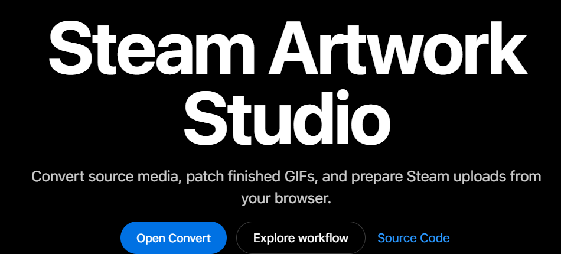

# Steam Artwork Toolkit

Create Steam-ready animated artwork from local videos and images - directly in your browser.

Steam Artwork Toolkit turns source media into correctly sized GIFs for Steam Workshop, Artwork, Featured, and Guide showcases. Choose a preset, set a size budget, run the conversion, preview the result, and download ready-to-upload files.

> **Browser-first and local by design:** source media is processed in the browser with WebAssembly and Web Workers. The application does not require a conversion server.

[](https://artwork-helper-by-val.netlify.app)


## Why use it?

- **Start from a Steam layout** - use presets for Workshop, Artwork, Featured, and Guide showcases.
- **Convert local media** - bring a video, GIF, PNG, WebP, JPG/JPEG, or BMP file.
- **Stay within a size budget** - the converter can retry with lower FPS or quality when an output is too large.
- **See what you are getting** - preview dimensions, file size, final FPS, quality reduction, and status metadata.
- **Export in one step** - download individual GIFs or a ZIP archive for multi-part artwork.
- **Keep working locally** - conversion runs in the browser using dedicated workers and WebAssembly.
- **Repair existing GIFs** - use the standalone EOF-byte and GIF-header patch tools when a file needs a final adjustment.
- **Use the interface your way** - English, Ukrainian, and Czech are supported, with an onboarding tour for first-time users.

## How it works

1. Choose a Steam artwork preset.
2. Select a local video or image.
3. Set the maximum file size and starting FPS, or use the recommended defaults.
4. Run the conversion.
5. Review the generated previews and download the GIFs or ZIP archive.

The first-run workflow keeps the common decisions visible. Retry, optimization, lossy compression, patching, and worker controls are available under **Advanced options** when you need them.

## Supported presets

| Preset | Output |
| --- | --- |
| **Workshop Showcase** | Configurable horizontal GIF slices. Defaults to 5 parts, 150 px per part, and 1 row. Supports 1-3 rows. |
| **Artwork Showcase** | Fixed two-part split: 506 px + 100 px from a 606 px layout. |
| **Featured Showcase** | Single wide GIF. Defaults to 630 px width. |
| **Guide** | Fixed centered square GIF at 195 x 195 px. |

Supported input sources:

- Browser-recognized video files (`video/*` and common video extensions)
- GIF, PNG, WebP, JPG/JPEG, and BMP images

Output names use the source file base name:

- Workshop and Artwork parts: `<source>_part_01.gif`, `<source>_part_02.gif`, ...
- Featured: `<source>_featured.gif`
- Guide: `<source>_guide.gif`
- Conversion ZIP: `<source>.zip`
- EOF patch ZIP: `eof-patch-output.zip`
- Header patch ZIP: `header-patch-output.zip`

## Example output

<p>
  
  
  
  
  
</p>

*Source video: [TikTok @denyx079](https://www.tiktok.com/@denyx079).*

## Privacy and local processing

Source media is processed locally in the browser. The normal conversion workflow does not upload source files to a conversion server.

The app uses `ffmpeg.wasm`, `gifski.wasm`, WebAssembly, and Web Workers to probe media, extract frames, encode GIFs, and create downloadable artifacts. Production hosting must provide the cross-origin isolation headers required by this runtime.

## Browser support

The converter is designed for desktop Chromium-class browsers such as Chrome and Edge. The app checks for the required runtime features and shows a diagnostic report when the environment is unsupported.

Required browser/runtime features:

- Secure context (`https`, `localhost`, or equivalent)
- Cross-origin isolation
- Web Workers
- WebAssembly
- `createImageBitmap`
- `OffscreenCanvas`

iOS/iPadOS WebKit and Android browser runtimes are treated as unsupported because the media pipeline is memory- and API-sensitive.

## Run locally

Requirements:

- Node.js 20+
- npm

Install and start the app:

```bash
cd web
npm ci
npm run dev
```

Then open the local URL printed by Vite. The local dev server includes the headers needed for browser conversion.

Build the production bundle:

```bash
cd web
npm run build
```

Preview a production build:

```bash
cd web
npm run preview
```

## Conversion controls

The default workflow is speed-conscious and size-aware:

- Starting GIF FPS: `15`
- Minimum retry FPS: `10`
- Optimization mode: `hybrid`
- Standard retries: enabled
- FPS reduction during retries: enabled
- Quality reduction during retries: enabled
- Lossy oversize fallback: enabled
- EOF patch during conversion: enabled, default byte `0x21`
- GIF header patch during conversion: disabled by default
- Worker count: automatically chosen from hardware concurrency and capped at 3

Advanced controls include:

- Raw mode, which disables optimization checks and retry ladders
- `hybrid`, `quality-first`, and `fast-fit` optimization modes
- An optional precheck for estimating whether a file may exceed the target size
- Configurable minimum FPS and retry behavior
- Lossy fallback level and maximum attempts
- Configurable EOF byte
- Optional GIF logical width/height header patching
- Worker count

If a GIF still exceeds the configured maximum size after retries, the app keeps the output and reports a warning instead of discarding the result.

## Patch tools

The Patch Tools panel can process existing GIFs without running a full conversion:

- **EOF-byte patch** - adjust the final byte when a platform-specific GIF fix is needed.
- **GIF-header patch** - edit the logical width and height stored in the GIF header.

Patched files can be downloaded individually or as a ZIP archive.

## Cross-origin isolation

The WASM media pipeline requires these response headers:

```text
Cross-Origin-Opener-Policy: same-origin
Cross-Origin-Embedder-Policy: require-corp
```

Local Vite dev and preview servers set these headers in `web/vite.config.ts`. Production hosting must provide the same headers or conversion will not run.

## Deployment

### Netlify

The root `netlify.toml` builds from `web/` and publishes `web/dist`:

```toml
[build]
  base = "web"
  command = "npm run build"
  publish = "dist"
```

### Cloudflare Workers

Cloudflare deployment is configured with:

- `web/wrangler.toml`
- `web/cloudflare/worker.ts`

Deploy with:

```bash
cd web
npm run deploy
```

The Cloudflare Worker serves the static app with the required COOP/COEP headers.

## Quality checks

```bash
cd web
npm run lint
npm run test
npm run test:e2e
npm run build
```

Available benchmark scripts:

```bash
cd web
npm run bench:workshop
npm run bench:memory
npm run bench:memory:cleanup
```

## Architecture

```text
React UI
  -> conversion session state
  -> typed conversion orchestrator
  -> worker pool
  -> ffmpeg.wasm source probing and frame extraction
  -> gifski.wasm GIF encoding
  -> optional patching
  -> preview, download, and ZIP export
```

Important implementation areas:

- `web/src/App.tsx` - app shell, tabs, onboarding entry point, and header actions.
- `web/src/AppRoot.tsx` - locale routing and saved language preference.
- `web/src/components/panels/` - Convert, Patch Tools, Steam Helpers, and Guides.
- `web/src/contexts/conversionSession.ts` - conversion UI and session state.
- `web/src/lib/conversion.ts` - conversion orchestration.
- `web/src/lib/conversionWorkerPool.ts` - worker lifecycle, scheduling, cancellation, and progress forwarding.
- `web/src/workers/ffmpeg.worker.ts` - media probing, frame extraction, GIF encoding, retries, and artifact creation.
- `web/src/lib/patch.ts` - EOF and GIF-header patching.
- `web/src/lib/zip.ts` - ZIP archive export.

## Repository map

- `web/` - primary browser app.
- `web/public/vendor/gifski/2.2.0/` - pinned, self-hosted gifski WASM runtime.
- `web/e2e/` - Playwright smoke tests.
- `web/src/**/*.test.ts` - Vitest coverage for conversion helpers, worker pool, patching, i18n, defaults, browser support, and sizing logic.
- `legacy/` - older Python CLI media and patching tools.
- `autofill/` - older Steam upload autofill snippets.
- `media/test-fixtures/` - local media fixtures for manual and automated testing.
- `docs/` - project overview, architecture, conversion pipeline, deployment, and troubleshooting notes.

## Legacy CLI tools

The browser app is the main workflow. These scripts remain available for older local workflows:

- `legacy/video_parts_pipeline.py` - local video-to-GIF pipeline.
- `legacy/steam_hex_patch.py` - local EOF-byte patch utility.
- `legacy/steam_hex_edit_header.py` - local GIF-header width/height editor.

Example:

```bash
python .\\legacy\\video_parts_pipeline.py --input .\\media\\my_video.mp4 --preset workshop
```

## Documentation

- [`web/README.md`](web/README.md)
- [`docs/README.md`](docs/README.md)
- [`docs/PROJECT_OVERVIEW.md`](docs/PROJECT_OVERVIEW.md)
- [`docs/TECHNICAL_ARCHITECTURE.md`](docs/TECHNICAL_ARCHITECTURE.md)
- [`docs/CONVERSION_PIPELINE.md`](docs/CONVERSION_PIPELINE.md)
- [`docs/DEPLOYMENT_RUNBOOK.md`](docs/DEPLOYMENT_RUNBOOK.md)
- [`docs/TROUBLESHOOTING.md`](docs/TROUBLESHOOTING.md)
- [`docs/CHROME_MCP_TESTING.md`](docs/CHROME_MCP_TESTING.md)

## License

This project is licensed under **AGPL-3.0-or-later**. See [`LICENSE`](LICENSE).

